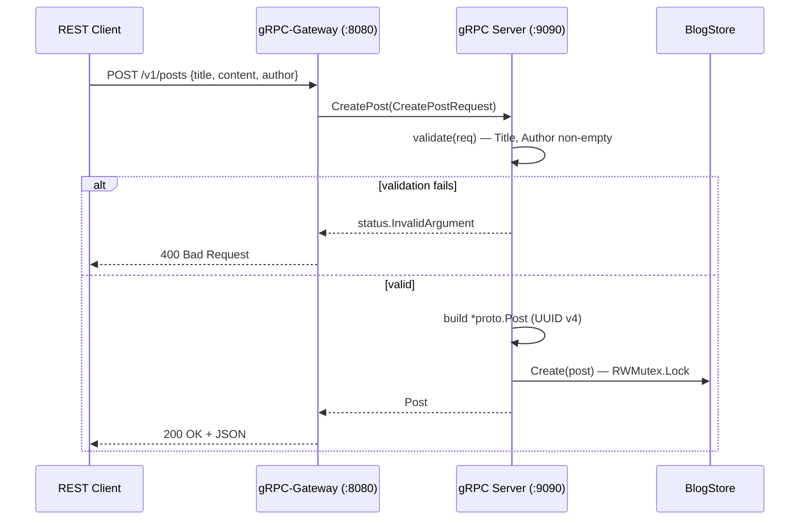

# grpc-blog-service

> A reference Go gRPC service for a Blog domain — Buf, gRPC-Gateway, Viper, mock-driven testing, and a thread-safe in-memory store. Built as a template for production CRUD services.

[](https://github.com/Chetas-Patil/grpc-blog-service/actions/workflows/ci.yml)
[](https://github.com/Chetas-Patil/grpc-blog-service/actions/workflows/security.yml)
[](https://go.dev/dl/)
[](https://grpc.io)
[](LICENSE)

---

## Why this exists

A small but opinionated reference implementation for teams that want:

- **Single source of truth** — `.proto` files generate Go server, Go client, **and** a REST gateway via gRPC-Gateway annotations.
- **Production patterns by default** — interface-segregated store, dependency injection, mock-driven testing, Viper-based config (file + env).
- **Buf-native tooling** — schema linting, breaking-change detection, deterministic codegen.

## System Architecture

```mermaid
flowchart LR
    subgraph Client
      A[REST client / curl]
      B[gRPC client]
    end
    A -- HTTP/JSON --> GW[gRPC-Gateway :8080]
    B -- HTTP/2 + Protobuf --> SRV[gRPC Server :9090]
    GW -- gRPC --> SRV
    SRV --> H[BlogService handler]
    H -- BlogStore interface --> ST[(blogStore<br/>sync.RWMutex<br/>map[postID]*Post)]

    classDef tx fill:#fdf6e3,stroke:#073642,color:#073642;
    class GW,SRV,H tx;
```

Both transports terminate at the same `BlogService` handler. The handler depends on the `BlogStore` **interface**, so the in-memory implementation can be swapped for Postgres, Redis, or any other backend without touching transport code.

### Request Lifecycle (REST → gRPC)



### Package Layout

```
grpc-blog-service/
├── proto/                 # .proto sources + generated *.pb.go, *_grpc.pb.go, *_gw.pb.go
├── server/                # gRPC server entry point + service handlers
├── client/                # smoke-test gRPC client (CRUD walkthrough)
├── internal/
│   ├── store/             # BlogStore interface + sync.RWMutex implementation
│   └── mocks/             # GoMock-generated test doubles
├── config/                # Viper-backed config loader + config.yaml
├── buf.yaml / buf.gen.yaml
├── Makefile               # generate, test, lint, mock, server, client targets
└── README.md
```

## Quick Start

### Prerequisites

- Go 1.24+
- Make
- (Optional) [Buf](https://buf.build/docs/installation) for `make generate`

### Run the server

```bash
make server
# gRPC :9090
# REST gateway :8080
```

### REST examples

```bash
# Create
curl -s -X POST http://localhost:8080/v1/posts \
  -H 'content-type: application/json' \
  -d '{"title":"Cloud Security 101","content":"...","author":"Chetas","tags":["cspm"]}'

# Read all
curl -s http://localhost:8080/v1/posts | jq

# Read by ID
curl -s http://localhost:8080/v1/posts/<post_id> | jq

# Update
curl -s -X PUT http://localhost:8080/v1/posts/<post_id> \
  -H 'content-type: application/json' \
  -d '{"title":"Cloud Security 101 (v2)","content":"...","author":"Chetas","tags":["cspm","dspm"]}'

# Delete
curl -s -X DELETE http://localhost:8080/v1/posts/<post_id>
```

### gRPC client smoke test

```bash
make client
```

Walks through Create → Read → Update → Delete against the gRPC server.

## Configuration

`config/config.yaml` is the file source; `viper.AutomaticEnv()` lets you override any key via environment variables (with `_` separators):

```yaml
GrpcServer:
  Host: localhost
  Port: 9090
  Protocol: tcp

GatewayServer:
  Host: localhost
  Port: 8080

GrpcClient:
  ServerAddress: "localhost:9090"
```

Override at runtime:

```bash
GRPCSERVER_PORT=9091 GATEWAYSERVER_PORT=8081 make server
```

## Testing

```bash
make test          # go test ./... -coverprofile + filter generated mocks
go test ./... -race -cover
```

Tests use [testify](https://github.com/stretchr/testify) for assertions and [Uber GoMock](https://github.com/uber-go/mock) for store mocks. Generated mocks live in `internal/mocks/` and are excluded from coverage to avoid inflating numbers.

Concurrency tests (`TestConcurrentCreate`, `TestConcurrentGetAndCreate`) exercise the store under `-race` to catch lock regressions.

## Code Quality & CI

| Check | Tool | Workflow |
|---|---|---|
| Build | `go build ./...` | `ci.yml` |
| Tests | `go test ./... -race -coverprofile` | `ci.yml` |
| Lint | `golangci-lint v2` | `ci.yml` |
| Schema | `buf lint`, `buf breaking` (manual) | local |
| SAST | `gosec` (SARIF → Code Scanning) | `security.yml` |
| Vulns | `govulncheck` | `security.yml` |
| Deps | `trivy fs` | `security.yml` |

CI runs on every push and PR to `main`. The security workflow also runs weekly on `cron: 0 6 * * 1`.

## Security Considerations

- **Transport is currently insecure** (`grpc.WithTransportCredentials(insecure.NewCredentials())`). For production, terminate TLS on a sidecar/ingress (Envoy, nginx, ALB) or replace `insecure.NewCredentials()` with `credentials.NewTLS(...)`. Pin to TLS 1.3 and enforce client certs on east-west traffic.
- **Validation is shallow** — `CreatePost` checks only that `Title` and `Author` are non-empty. Add length caps, content sanitization (e.g., strip HTML if rendering server-side), and tag enums before exposing externally.
- **Authorization is unenforced.** Wire up `grpc.UnaryInterceptor` for auth (JWT, mTLS, OAuth) and authorization (per-author edit/delete checks) before any multi-tenant deployment.
- **Generated code is committed** under `proto/`. Re-run `make generate` whenever `.proto` evolves; CI should fail if the working tree differs from the generated output (TODO).
- **No PII model.** This is a Blog service, but if extended for end-user content, classify and tag PII fields, plumb them through structured logs (e.g. `slog` with `Replace` redaction), and document retention.

## Scalability

The current store is **in-memory** and **single-process** — fine for development and demos, not for production traffic. Key levers for going further:

| Lever | Action |
|---|---|
| Horizontal | Replace `blogStore` with a Postgres-backed implementation (no handler changes — `BlogStore` interface is the seam). |
| Caching | Add a Redis read-through layer behind the same interface. |
| Streaming | Add `ReadAllStream` returning a server-streaming RPC for large result sets. |
| Backpressure | Use `grpc.MaxConcurrentStreams`, request size limits, and `grpc.UnaryInterceptor` with `golang.org/x/time/rate`. |
| Observability | OpenTelemetry interceptors (gRPC + HTTP), structured `slog`, `/metrics` endpoint with `grpc_prometheus`. |

## Roadmap

- [ ] Persistent store (Postgres) behind the existing `BlogStore` interface
- [ ] OpenTelemetry tracing + metrics
- [ ] mTLS + JWT auth interceptor
- [ ] Buf breaking-change check in CI
- [ ] OpenAPI v3 spec generation from `.proto`

## License

See [LICENSE](LICENSE).
